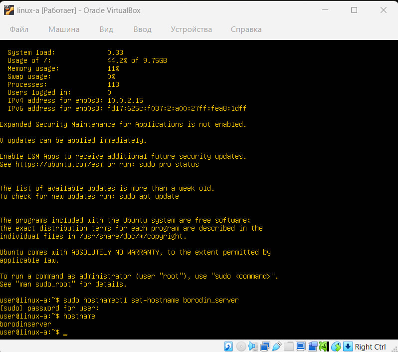
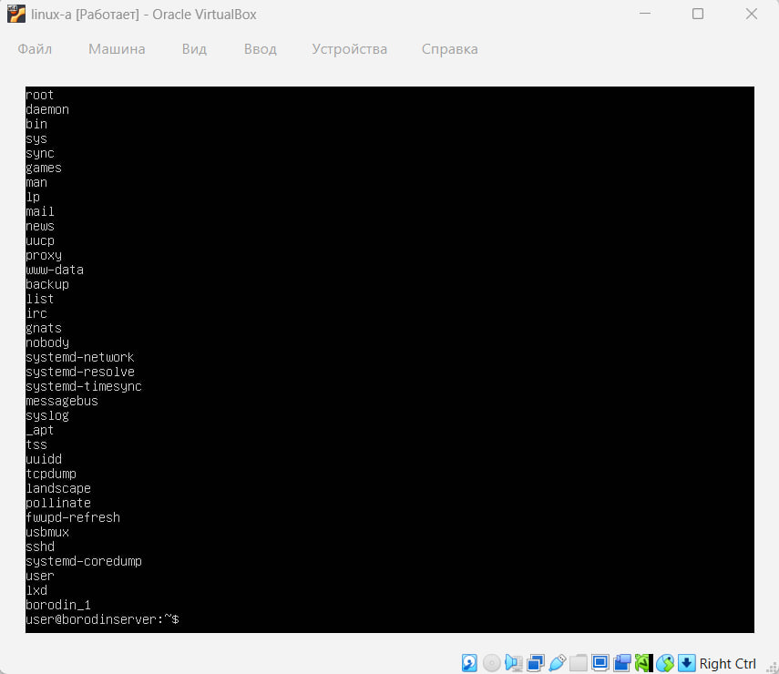
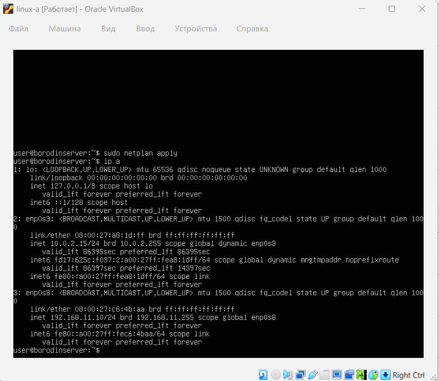
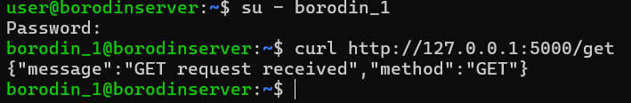
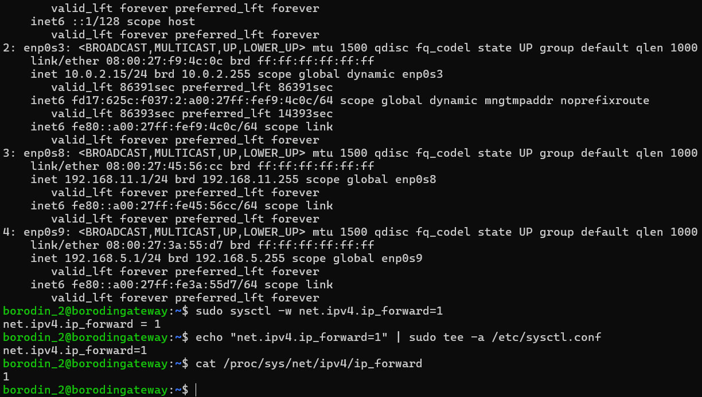
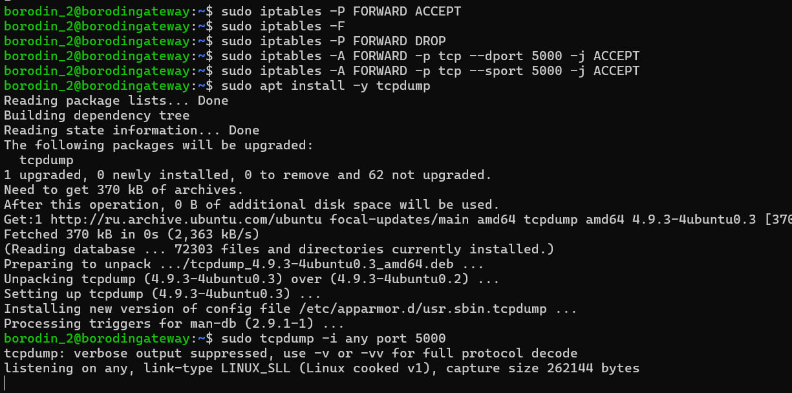
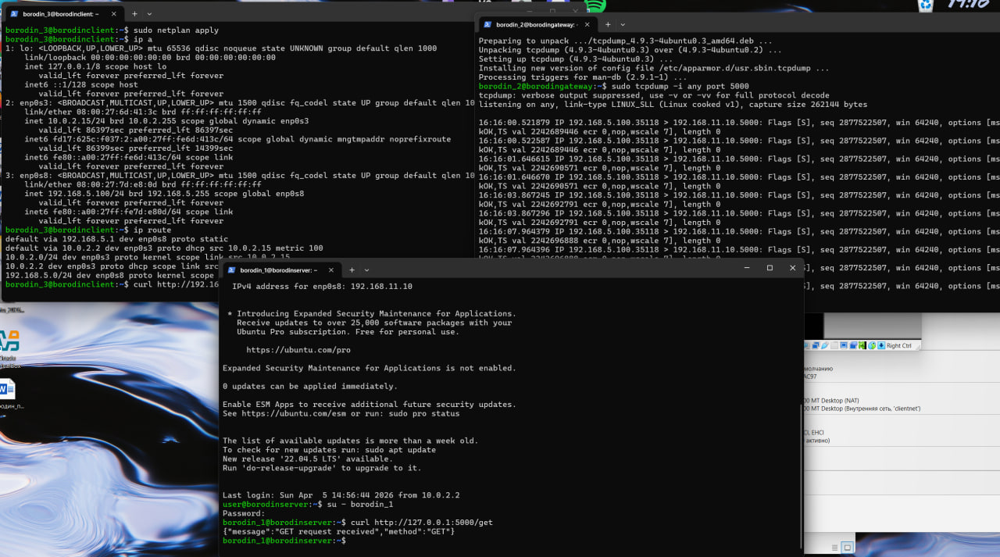
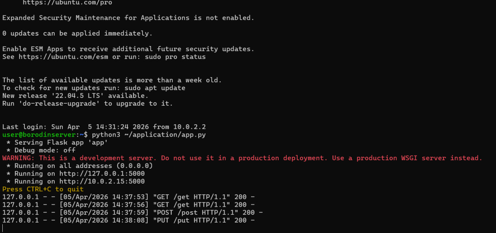

# Отчет по первой лабораторной работе Linux (Бородин Михаил 11.05 группа 5142704/50801)

## Цель работы

Настроить сетевую архитектуру из трех виртуальных машин Linux:
- Linux A- HTTP-сервер
- Linux B - шлюз (gateway/router)
- Linux C - клиент

Необходимо обеспечить маршрутизацию трафика между Linux C и Linux A через Linux B, развернуть HTTP-сервер на порту 5000 и подтвердить прохождение трафика через gateway с помощью `tcpdump`.

## Схема сети

`Linux A <-> Linux B <-> Linux C`

### Подсеть между Linux A и Linux B
- Linux A: `192.168.11.10/24`
- Linux B: `192.168.11.1/24`

### Подсеть между Linux B и Linux C
- Linux B: `192.168.5.1/24`
- Linux C: `192.168.5.100/24`

## Параметры виртуальных машин



### Linux A
- Hostname: `borodin_server`
- Пользователь: `borodin_1`

- IP-адрес: `192.168.11.10/24` 

- HTTP-сервер flask на порту `5000`




### Linux B
- Hostname: `borodin_gateway`
- Пользователь: `borodin_2`
- IP-адрес 1: `192.168.11.1/24`
- IP-адрес 2: `192.168.5.1/24`
- Включена маршрутизация IPv4, настроен firewall для пропуска HTTP-трафика по TCP-порту `5000`





### Linux C
- Hostname: `borodin_client`
- Пользователь: `borodin_3`
- IP-адрес: `192.168.5.100/24`
- Шлюз по умолчанию: `192.168.5.1`



## Настройка Linux A

На Linux A был изменен hostname на `borodin_server`, создан пользователь `borodin_1`, настроен статический IP-адрес `192.168.11.10/24` на внутреннем интерфейсе.

На машине был развернут HTTP-сервер на flask, работающий на порту `5000`. + Реализация трёх эндпоинтов:
- `/get`
- `/post`
- `/put`



Для автоматического запуска приложения после перезагрузки был создан systemd-сервис `web-server.service`.

## Настройка Linux B

На Linux B был изменен hostname на `borodin_gateway`, создан пользователь `borodin_2`, сконфигурированы два интерфейса:
- `192.168.11.1/24`
- `192.168.5.1/24`

Для пересылки пакетов между подсетями была включена маршрутизация IPv4:

```bash
net.ipv4.ip_forward=1
```

С помощью `iptables` была настроена фильтрация трафика. Разрешена пересылка только HTTP-пакетов по TCP-порту `5000` между интерфейсами `enp0s9` и `enp0s8`. Политика цепочки `FORWARD` установлена в `DROP`.

Для анализа прохождения HTTP-трафика использовалась утилита `tcpdump` с фильтром:

```bash
sudo tcpdump -i any port 5000
```

## Настройка Linux C

На Linux C был изменен hostname на `borodin_client`, создан пользователь `borodin_3`, настроен IP-адрес `192.168.5.100/24` и шлюз по умолчанию `192.168.5.1`.

После этого с Linux C выполнялись HTTP-запросы к Linux A через Linux B.

## Исходный код HTTP-сервера

В каталоге `application` размещен исходный код Flask-приложения `app.py`, реализующего минимально требуемые эндпоинты.

Пример проверочных запросов:

```bash
curl http://192.168.11.10:5000/get
curl -X POST http://192.168.11.10:5000/post -H "Content-Type: application/json" -d '{"name":"test"}'
curl -X PUT http://192.168.11.10:5000/put -H "Content-Type: application/json" -d '{"id":1}'
```

## Проверка работы

На Linux A сервер корректно запускался и отвечал на запросы `GET`, `POST` и `PUT`.

На Linux C был выполнен запрос:

```bash
curl http://192.168.11.10:5000/get
```

В ответ был получен корректный JSON от сервера Linux A.

На Linux B с помощью `tcpdump` был зафиксирован проходящий трафик по порту `5000`, что подтверждает маршрутизацию HTTP-пакетов через gateway.

## Проверка после перезагрузки

После перезагрузки виртуальных машин были проверены условия:
- сетевые настройки сохранились;
- systemd-сервис `web-server` на Linux A автоматически запустился;
- параметр `net.ipv4.ip_forward=1` на Linux B сохранился;
- правила `iptables` на Linux B сохранились;
- Linux C продолжил успешно обращаться к Linux A по адресу `192.168.11.10:5000`.

Таким образом, вся сетевая архитектура и необходимые сервисы продолжили функционирование после reboot.

## Конфигурационные файлы

В каталоге `configs` размещены:
- `linux-a-netplan.yaml`
- `linux-b-netplan.yaml`
- `linux-c-netplan.yaml`
- `web-server.service`
- `sysctl-b.conf`
- `rules.v4`

## Структура репозитория

```text
application/
  app.py
configs/
  linux-a-netplan.yaml
  linux-b-netplan.yaml
  linux-c-netplan.yaml
  web-server.service
  sysctl-b.conf
  rules.v4
images/
report.md
```

## Вывод

В ходе работы была настроена инфраструктура из трех виртуальных машин Linux с маршрутизацией трафика через промежуточный шлюз.
На Linux A был развернут HTTP-сервер на Flask на порту `5000`.
С Linux C были успешно выполнены HTTP-запросы к Linux A через Linux B.
Прохождение трафика было подтверждено с помощью `tcpdump` на Linux B.
После перезагрузки все основные настройки и сервисы сохранились и продолжили работать.
